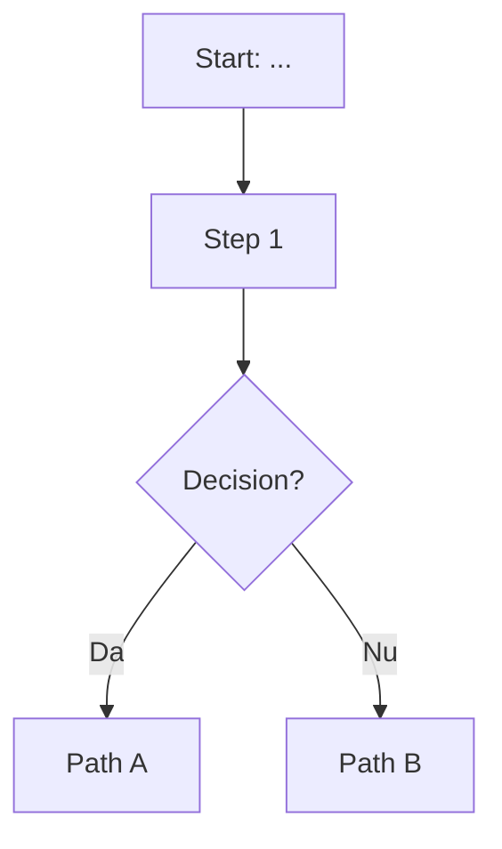

# Phase 1: System Audit - Research

**Researched:** 2026-01-23
**Domain:** ERP system audit methodology and codebase documentation
**Confidence:** HIGH

## Summary

Phase 1 is a documentation-only phase focused on creating a complete understanding of the existing ERP system before making any changes. Unlike implementation phases, this phase does not involve writing production code - it involves systematic examination of pages, APIs, and business flows to create audit documentation.

The research reveals that this audit should follow a structured methodology: starting with page-by-page UI documentation, then API endpoint cataloging, then E2E business flow tracing, and finally architecture/tech debt analysis. The existing codebase analysis documents (in `.planning/codebase/`) provide an excellent foundation, but the audit needs to extend these with:
1. Live verification against the production system
2. User-confirmed expected behavior baselines
3. Issue classification by business impact (Blocheza munca / Deranjeaza / Cosmetic)

**Primary recommendation:** Execute audit in four sequential plans, with the user serving as the source of truth for expected business behavior. Document comprehensively in Romanian, using tables for structured data and prose for flow descriptions.

## Standard Stack

This is a documentation phase - no new libraries needed.

### Existing Tools to Leverage

| Tool | Purpose | How to Use |
|------|---------|------------|
| Browser DevTools | Page inspection, network requests | Verify API calls, response times |
| Prisma Studio | Database inspection | Verify data model understanding |
| Production App | Live verification | User executes step-by-step instructions |
| Git | Codebase exploration | Track what code exists vs. what's documented |

### Documentation Format

| Format | Use Case | Example |
|--------|----------|---------|
| Markdown tables | Page elements, API endpoints, field inventories | Button, functie, status |
| Prose | Flow descriptions, behavior explanations | "Cand se apasa X, sistemul face Y" |
| Mermaid diagrams | E2E flows, state transitions | order → factura → AWB → livrare |
| Screenshots | UI reference where text is insufficient | Complex layouts, error states |

## Architecture Patterns

### Recommended Audit Document Structure

```
.planning/phases/01-system-audit/
├── 01-CONTEXT.md           # Already exists - user decisions
├── 01-RESEARCH.md          # This file - methodology
├── 01-01-PLAN.md           # Dashboard pages audit plan
├── 01-02-PLAN.md           # API endpoints audit plan
├── 01-03-PLAN.md           # E2E business flows audit plan
├── 01-04-PLAN.md           # Architecture/tech debt audit plan
└── audit-output/           # Audit deliverables
    ├── pages/              # Per-page documentation
    │   ├── orders.md       # Orders page audit
    │   ├── invoices.md     # Invoices page audit
    │   └── ...
    ├── api/                # API endpoint catalog
    │   ├── orders-api.md   # /api/orders/* endpoints
    │   ├── invoices-api.md # /api/invoices/* endpoints
    │   └── ...
    ├── flows/              # E2E flow documentation
    │   ├── order-to-delivery.md
    │   ├── internal-settlement.md
    │   └── ...
    └── tech-debt.md        # Consolidated tech debt inventory
```

### Pattern 1: Page Audit Document Structure

**What:** Consistent format for documenting each dashboard page
**When to use:** Every page.tsx in src/app/(dashboard)/

```markdown
# [Page Name] - Audit

**Auditat:** [date]
**Status:** [Functioneaza / Probleme Minore / Probleme Majore]
**URL:** /[path]
**Fisier:** src/app/(dashboard)/[path]/page.tsx
**Linii cod:** [number]

## Scopul Paginii

[1-2 propozitii: ce face pagina si cine o foloseste]

## Elemente UI

### Actiuni (Butoane/Link-uri)

| Element | Locatie | Functionalitate | Status |
|---------|---------|-----------------|--------|
| [Buton X] | [header/tabel/modal] | [ce face] | [OK/BUG/LIPSESTE] |

### Campuri de Date

| Camp | Sursa | Editabil | Validare |
|------|-------|----------|----------|
| [Nume camp] | [Model.field] | [Da/Nu] | [descriere] |

### Filtre

| Filtru | Tip | Optiuni | Status |
|--------|-----|---------|--------|
| [Nume] | [select/date/text] | [valori] | [OK/BUG] |

## Comportament Observat

### La Incarcare
[Ce se intampla cand pagina se incarca]

### Actiuni Principale
[Pentru fiecare actiune: ce se intampla cand se executa]

## Discrepante

| ID | Comportament Asteptat | Comportament Actual | Severitate |
|----|----------------------|---------------------|------------|
| D1 | [ce ar trebui sa faca] | [ce face] | [Blochează/Deranjează/Cosmetic] |

## Cod Mort / Nefolosit

[Features vizibile dar nefolosite de user]

## Note pentru Planificare

[Observatii relevante pentru fazele urmatoare]
```

### Pattern 2: API Endpoint Audit Structure

**What:** Consistent format for documenting each API endpoint
**When to use:** Every route.ts in src/app/api/

```markdown
# API: [Resource] - Audit

**Auditat:** [date]
**Base Path:** /api/[resource]

## Endpoints

### GET /api/[resource]

| Aspect | Detalii |
|--------|---------|
| Scop | [ce returneaza] |
| Auth | [Da - permisiune / Nu] |
| Permisiune | [permission.code sau N/A] |
| Parametri Query | [lista parametri cu tipuri] |
| Response | [structura JSON] |
| Paginare | [Da - page,limit / Nu] |
| Status | [OK / Probleme: ...] |

### POST /api/[resource]

| Aspect | Detalii |
|--------|---------|
| Scop | [ce creeaza/modifica] |
| Auth | [Da - permisiune / Nu] |
| Permisiune | [permission.code] |
| Body | [structura JSON asteptata] |
| Validare | [Zod schema / Manual / Lipsa] |
| Response | [structura JSON] |
| Side Effects | [ce alte actiuni se executa] |
| Status | [OK / Probleme: ...] |

## Observatii de Securitate

[Probleme de autorizare, validare input, etc.]

## Probleme de Performanta

[N+1 queries, lipsa paginare, etc.]
```

### Pattern 3: E2E Flow Documentation Structure

**What:** Documenting complete business flows from start to finish
**When to use:** For each critical business process

```markdown
# Flow: [Flow Name]

**Auditat:** [date]
**Status:** [Complet Documentat / Partial / Neclar]

## Diagrama Flow



## Etape Detaliate

### Etapa 1: [Nume]

**Trigger:** [Ce initiaza etapa]
**Actor:** [Cine executa - user/sistem]
**Actiuni:**
1. [Actiune 1]
2. [Actiune 2]

**Date modificate:**
- [Model.field]: [de la] → [la]

**API Calls:**
- POST /api/...

**Validari:**
- [Ce se verifica]

**Puncte de Esec:**
- [Ce poate merge gresit si ce se intampla]

### Etapa 2: [Nume]
...

## Exceptii si Edge Cases

| Situatie | Comportament Asteptat | Comportament Actual |
|----------|----------------------|---------------------|
| [situatie] | [ce ar trebui] | [ce se intampla] |

## Intrebari pentru User

[Puncte unde comportamentul asteptat e neclar]
```

### Anti-Patterns to Avoid

- **Assuming behavior instead of verifying:** Do not document what code looks like it should do - verify against production
- **Skipping "boring" pages:** Even settings pages need audit - they often have critical configuration
- **Documenting without user confirmation:** The user is the source of truth for expected business behavior
- **Mixing audit with fix suggestions:** Keep audit pure documentation; fixes go in later phases
- **Ignoring dead code:** FreshSales/BaseLinker code exists but user doesn't use it - flag it

## Don't Hand-Roll

Problems that should use existing solutions:

| Problem | Don't Build | Use Instead | Why |
|---------|-------------|-------------|-----|
| Diagrams | ASCII art | Mermaid in Markdown | Renderable, maintainable |
| Code stats | Manual counting | `wc -l`, IDE features | Accurate, repeatable |
| API testing | curl scripts | Browser DevTools | Visual, preserved history |
| Schema review | Reading schema.prisma | Prisma Studio | Visual relationships |

**Key insight:** The audit phase produces documentation, not code. Avoid creating tooling - use what exists.

## Common Pitfalls

### Pitfall 1: Documenting Code Not Behavior
**What goes wrong:** Auditor reads code and documents what it appears to do
**Why it happens:** Faster than testing, seems accurate
**How to avoid:** Every documented behavior must be verified against production
**Warning signs:** Documentation says "should" instead of "does"

### Pitfall 2: Missing the Business Context
**What goes wrong:** Technical audit without understanding why something exists
**Why it happens:** Code-first thinking
**How to avoid:** Ask user about each major feature: "Ce inseamna asta pentru business?"
**Warning signs:** Can describe what code does but not why it matters

### Pitfall 3: Incomplete Issue Classification
**What goes wrong:** Issues documented but not classified by business impact
**Why it happens:** Treating all bugs as equal
**How to avoid:** Use the agreed classification: Blochează munca / Deranjează / Cosmetic
**Warning signs:** No severity assigned, or all issues marked same severity

### Pitfall 4: Auditing in Isolation
**What goes wrong:** Auditor works silently, user sees only final document
**Why it happens:** Trying to be efficient
**How to avoid:** Surface issues immediately if they're critical; ask user to verify behavior
**Warning signs:** Large batches of documentation without user interaction

### Pitfall 5: Ignoring Existing Analysis
**What goes wrong:** Re-documenting what's already in .planning/codebase/
**Why it happens:** Not checking existing work
**How to avoid:** Start from existing ANALYSIS-2026-01-23.md, CONCERNS.md, etc.
**Warning signs:** Duplicating known issues as "discoveries"

## Code Examples

### Example: Verifying API Endpoint Behavior

```typescript
// To audit: src/app/api/orders/route.ts

// Step 1: Check auth requirement
// Look for getServerSession() at line ~10-20
const session = await getServerSession(authOptions);
if (!session) {
  return NextResponse.json({ error: "..." }, { status: 401 });
}

// Step 2: Check permission requirement
// Look for hasPermission() call
const canView = await hasPermission(session.user.id, "orders.view");

// Step 3: Document query parameters
// Look for searchParams usage
const page = searchParams.get("page") || "1";
const status = searchParams.get("status");
const storeId = searchParams.get("storeId");

// Step 4: Verify against production
// User: "Mergi la /orders, deschide Network tab, filtreaza pe status PENDING"
// Verify: Request goes to /api/orders?status=PENDING
// Verify: Response structure matches documented
```

### Example: Page Element Inventory

```markdown
## Orders Page Elements

### Header Actions
| Element | Tip | Functie | Permisiune |
|---------|-----|---------|------------|
| Sync Orders | Button | Trigger sync with Shopify | orders.sync |
| Export Excel | Button | Download orders as .xlsx | orders.export |
| New Order | Button (disabled) | Create manual order | orders.create |

### Table Columns
| Coloana | Sortable | Filterable | Sursa |
|---------|----------|------------|-------|
| # | Da | Nu | Order.shopifyOrderNumber |
| Client | Nu | Da (search) | Order.customerFirstName + lastName |
| Status | Nu | Da (select) | Order.status (enum) |
| Total | Da | Nu | Order.totalPrice |
| Data | Da | Da (date range) | Order.shopifyCreatedAt |
```

## State of the Art

This is methodology documentation, not technology evaluation. The "state of the art" is:

| Approach | Modern Practice | What We'll Do |
|----------|-----------------|---------------|
| Code audit | Combine static analysis + manual review | Manual review (small codebase) |
| Documentation | Structured markdown + diagrams | Markdown with Mermaid |
| Issue tracking | Integrated with code (GitHub Issues) | Inline in audit docs, migrate later if needed |
| Verification | Automated tests | Manual verification with user |

## Open Questions

Questions that couldn't be fully resolved and need user input during execution:

1. **FreshSales/BaseLinker Code**
   - What we know: Code exists in codebase, user confirmed they don't use it
   - What's unclear: Should it be flagged for removal in Phase 5, or kept for potential future use?
   - Recommendation: Flag as dead code, defer removal decision to user

2. **Trendyol Integration Status**
   - What we know: Full integration exists (orders, products, mapping)
   - What's unclear: Is this actively used or in testing phase?
   - Recommendation: Include in audit but mark status based on user confirmation

3. **Ads Module (Meta/TikTok)**
   - What we know: Extensive code exists (~80KB in meta-ads.ts alone)
   - What's unclear: Is this in active use or future feature?
   - Recommendation: Quick audit to determine if in-scope or deferrable

4. **Audit Depth for Settings Pages**
   - What we know: Many settings sub-pages exist
   - What's unclear: Which settings are actively configured vs. legacy?
   - Recommendation: Ask user which settings they actually touch

## Sources

### Primary (HIGH confidence)
- Existing codebase analysis in `.planning/codebase/`:
  - STRUCTURE.md - complete directory layout
  - CONCERNS.md - known issues and tech debt
  - ARCHITECTURE.md - system design documentation
  - INTEGRATIONS.md - external service connections
- ANALYSIS-2026-01-23.md - comprehensive issue inventory
- REQUIREMENTS.md - audit requirements (AUDIT-01 through AUDIT-05)
- 01-CONTEXT.md - user decisions about audit approach

### Secondary (MEDIUM confidence)
- [Code Audit Best Practices](https://www.codeant.ai/blogs/source-code-audit-checklist-best-practices-for-secure-code) - methodology guidance
- [ERP Audit Checklist](https://www.phoenixstrategy.group/blog/checklist-for-erp-audit-readiness) - business audit patterns
- [Code Audit Playbook 2025](https://softjourn.com/insights/code-audit-playbook) - modern audit approaches

### Tertiary (LOW confidence)
- General web search results for audit methodology
- Training data about ERP systems (may be outdated)

## Metadata

**Confidence breakdown:**
- Standard methodology: HIGH - based on existing codebase docs and established audit practices
- Document structure: HIGH - follows established patterns from existing analysis docs
- Pitfalls: HIGH - directly derived from CONTEXT.md user decisions and existing issues
- Verification approach: HIGH - explicitly discussed and decided in CONTEXT.md

**Research date:** 2026-01-23
**Valid until:** N/A - methodology document, not version-dependent

---

## Audit Execution Guidelines

### Priority Order

Based on CONTEXT.md decisions:

1. **Orders page** - Principal concern, daily work happens here
2. **E2E Flow** - order → factură → AWB → livrare → încasare (equally important stages)
3. **Integration-heavy pages** - Facturis (biggest pain point), SelfAWB, Shopify
4. **Settings pages** - Configuration that affects all flows
5. **Everything else** - Inventory, Products, Ads, etc.

### Verification Protocol

For each page/flow audited:

1. **Code Review** - Read the source file, note structure and dependencies
2. **Production Verification** - Provide step-by-step instructions for user to execute
3. **User Confirmation** - "Is this how it should work?" for business logic
4. **Issue Documentation** - Any discrepancy gets classified and documented
5. **Integration Check** - Which APIs does this page call? Are they documented?

### Issue Classification

As decided in CONTEXT.md:

| Classification | Romanian | Meaning | Example |
|----------------|----------|---------|---------|
| Blochează munca | Critical | Cannot complete daily operations | Invoice won't generate |
| Deranjează | Annoying | Works but causes friction | Extra clicks needed |
| Cosmetic | Nice-to-have | Visual or minor UX issues | Misaligned button |

### Language

- All audit documents in **Romanian**
- Business terms stay natural: factură, AWB, decontare, livrare
- Technical terms can be English where clearer: API, endpoint, query

### Dead Code Flagging

Per user instruction: "Flaggez TOT codul mort și feature-urile nefolosite"

- FreshSales integration - user doesn't use, verify dead
- BaseLinker integration - user doesn't use, verify dead
- Any feature visible in UI but user says "nu folosesc"
