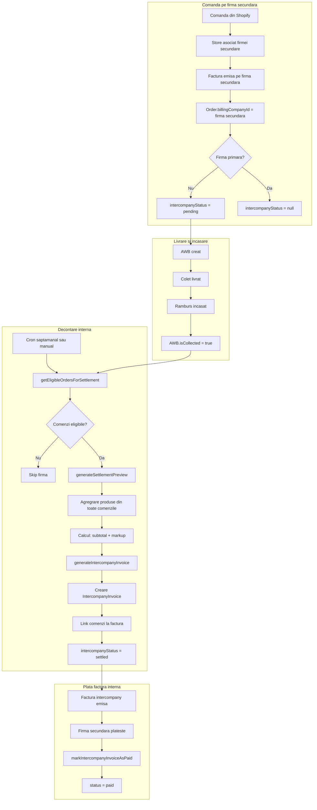

# Flow: Decontare Interna (Internal Settlement)

**Auditat:** 2026-01-23
**Status:** Complet Documentat
**Implementare:** PARTIAL - Logica exista, UI/cron necesita verificare

## Rezumat

Decontarea interna este procesul prin care Aquaterra (firma primara) factureaza firmele secundare pentru comenzile procesate in numele lor. Acest flux este necesar pentru contabilitate cand comenzi de pe magazine ale firmei B sunt facturate pe firma A.

**Scenariul tipic:**
1. Comanda vine pe magazin asociat firmei secundare
2. Factura se emite pe firma secundara catre client final
3. AWB se creeaza, coletul se livreaza, rambursul se incaseaza
4. Periodic (saptamanal), Aquaterra factureaza firma secundara pentru costul produselor + markup

## Diagrama Flow



## Etape Detaliate

### Etapa 1: Identificare comenzi firma secundara

**Trigger:** La emiterea facturii, daca firma NU e primara

**Actiuni:**
1. In `issueInvoiceForOrder`:
   ```typescript
   // Linia 453 din invoice-service.ts
   if (!company.isPrimary) {
     await tx.order.update({
       where: { id: order.id },
       data: { intercompanyStatus: "pending" },
     });
   }
   ```

2. Comanda ramane cu `intercompanyStatus = "pending"` pana la decontare

**Date modificate:**
- Order.intercompanyStatus: null -> `pending`
- Order.billingCompanyId: ID firma secundara

**Criterii firma secundara:**
- Company.isPrimary = false
- Company.isActive = true

---

### Etapa 2: Tracking "incasat" (Collection)

**Trigger:** Sync periodic FanCourier sau manual

**Conditie pentru eligibilitate decontare:**
```typescript
// Linia 96 din intercompany-service.ts
awb: {
  isCollected: true, // Ramburs incasat
}
```

**Logica:**
- AWB trebuie sa fie marcat ca "incasat" de curier
- Acest flag se seteaza la sync cand curierul confirma colectarea rambursului
- Doar comenzile cu ramburs incasat intra in decontare

---

### Etapa 3: Calcul decontare (Settlement Preview)

**Trigger:** Manual din UI sau cron saptamanal (`runWeeklySettlement`)

**Functie:** `generateSettlementPreview(companyId, periodStart?, periodEnd?)`

**Actiuni:**
1. Obtine comenzile eligibile pentru o firma:
   ```typescript
   const orders = await getEligibleOrdersForSettlement(companyId, periodStart, periodEnd);
   ```

2. Agregare produse din toate comenzile:
   - Grupeaza dupa SKU
   - Sumeaza cantitatile
   - Calculeaza valoare totala

3. Calcul markup (default 10%):
   ```typescript
   const markup = Number(company.intercompanyMarkup) || 10;
   const markupAmount = subtotal * markup / 100;
   const total = subtotal + markupAmount;
   ```

**Output:**
```typescript
interface SettlementPreview {
  companyId: string;
  companyName: string;
  periodStart: Date;
  periodEnd: Date;
  orders: Array<{id, orderNumber, totalPrice, processedAt}>;
  lineItems: Array<{sku, title, quantity, unitCost, markup, lineTotal}>;
  totalOrders: number;
  totalItems: number;
  subtotal: number;       // Valoare produse
  markup: number;         // Procent markup (10%)
  markupAmount: number;   // Suma markup
  total: number;          // Final de plata
}
```

---

### Etapa 4: Generare factura interna

**Functie:** `generateIntercompanyInvoice(companyId, periodStart?, periodEnd?)`

**Actiuni:**
1. Genereaza numar factura unic:
   ```typescript
   const invoiceNumber = `IC-${year}-${String(count + 1).padStart(5, "0")}`;
   // Ex: IC-2026-00001
   ```

2. Creeaza factura intercompany (tranzactie atomica):
   - `issuedByCompanyId`: firma primara (Aquaterra)
   - `receivedByCompanyId`: firma secundara
   - `totalValue`: total calculat
   - `lineItems`: JSON cu produsele agregate
   - `status`: `pending`

3. Leaga comenzile de factura:
   - Creeaza `IntercompanyOrderLink` pentru fiecare comanda
   - Actualizeaza `Order.intercompanyStatus = "settled"`

**Date modificate:**
- IntercompanyInvoice: created
- IntercompanyOrderLink: created pentru fiecare comanda
- Order.intercompanyStatus: `pending` -> `settled`

---

### Etapa 5: Plata factura

**Functie:** `markIntercompanyInvoiceAsPaid(invoiceId)`

**Actiuni:**
1. Verifica factura exista si nu e deja platita
2. Actualizeaza:
   - status: `pending` -> `paid`
   - paidAt: current timestamp

**Cine plateste:**
- Firma secundara transfera banii catre firma primara
- Procesul de plata e in afara sistemului (bancar)
- User marcheaza manual ca platita

---

## Starea Curenta a Implementarii

### Ce EXISTA:

| Component | Status | Locatie |
|-----------|--------|---------|
| Marcare pending la facturare | IMPLEMENTAT | invoice-service.ts:453 |
| Serviciu decontare | IMPLEMENTAT | intercompany-service.ts |
| Model IntercompanyInvoice | IMPLEMENTAT | schema.prisma |
| Model IntercompanyOrderLink | IMPLEMENTAT | schema.prisma |
| Calcul preview | IMPLEMENTAT | generateSettlementPreview |
| Generare factura | IMPLEMENTAT | generateIntercompanyInvoice |
| Marcare platita | IMPLEMENTAT | markIntercompanyInvoiceAsPaid |
| Cron saptamanal | IMPLEMENTAT | runWeeklySettlement |

### Ce LIPSESTE sau e NECLAR:

| Component | Status | Note |
|-----------|--------|------|
| UI pentru vizualizare | NECLAR | Exista pagina /intercompany? |
| Cron job activ | NECLAR | Ruleaza efectiv saptamanal? |
| Notificari | LIPSESTE | Nu exista alerte pentru decontare pending |
| Export factura PDF | LIPSESTE | Doar date in DB, fara document |
| Integrare Facturis | LIPSESTE | Factura interna nu se emite in Facturis |

### Intrebari pentru User:

1. **Este acest flow folosit activ?**
   - Se ruleaza decontarea saptamanala?
   - Exista UI unde se vede?

2. **Care este firma secundara?**
   - Nume exact
   - Markup-ul e 10% sau altul?

3. **Cum se proceseaza factura interna?**
   - Se emite si in Facturis sau doar intern?
   - Exista document PDF?

4. **Cron job-ul ruleaza?**
   - Vercel cron sau manual?

---

## Cross-Reference

### Cerinte (REQUIREMENTS.md)

| ID | Cerinta | Status |
|----|---------|--------|
| INV-03 | Identificare automata comenzi firma B | IMPLEMENTAT |
| INV-04 | Tracking "incasat" per comanda | PARTIAL (depinde de sync) |
| INV-05 | Decontare saptamanala cu pret achizitie + 10% | IMPLEMENTAT |
| INV-06 | Generare factura interna | IMPLEMENTAT (fara PDF/Facturis) |

### Cod

| Fisier | Scop |
|--------|------|
| src/lib/intercompany-service.ts | Logica principala |
| prisma/schema.prisma | Modele IntercompanyInvoice, IntercompanyOrderLink |

---

## Note pentru Faze Urmatoare

### Phase 3 - Dashboard Enhancement
- Adaugare widget pentru decontari pending
- Lista facturi intercompany

### Phase 6 - Automation
- Verificare/configurare cron job
- Notificari pentru decontare

### Phase 9 - Reporting
- Rapoarte decontare per firma
- Export facturi interne
