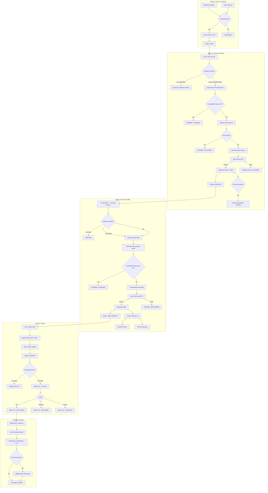

# Flow: Comanda la Livrare (Order-to-Delivery)

**Auditat:** 2026-01-23
**Status:** Complet Documentat - VERIFICAT DE USER
**Relevanta:** CRITICA - Fluxul zilnic principal

> **User Verification (2026-01-23):** Flow-ul a fost aprobat. User a solicitat documentarea COMPLETA a tuturor codurilor de status FanCourier pentru tracking - aceasta va fi adresata in fazele urmatoare (vezi nota la finalul documentului).

## Rezumat

Acest document traseaza calea completa a unei comenzi de la import din Shopify pana la colectarea platii. Este fluxul de baza pe care echipa il executa zilnic.

**Etape principale:** Comanda -> Factura -> AWB -> Livrare -> Incasare

## Diagrama Flow

## Etape Detaliate

### Etapa 1: Import Comanda din Shopify

**Trigger:**
- Webhook Shopify (automat la comanda noua)
- Sync manual (buton "Sync Orders" din interfata)

**Actor:** Sistem (webhook) sau User (sync manual)

**Actiuni:**
1. Primeste date comanda de la Shopify API
2. Verifica daca comanda exista deja (dupa shopifyOrderId)
3. Creeaza/actualizeaza Order cu toate campurile:
   - Date client: firstName, lastName, email, phone
   - Adresa livrare: address1, address2, city, province, country, zip
   - Date financiare: totalPrice, subtotal, totalDiscount, totalShipping, totalTax
   - Produse: LineItems cu sku, title, price, quantity
4. Asociaza comanda cu Store-ul corespunzator
5. Seteaza status initial: `NEW`

**Date modificate:**
- Order: created cu status `NEW`
- LineItem: create pentru fiecare produs

**API Calls:**
- Shopify: GET /admin/api/2023-10/orders.json (la sync)
- Internal: POST /api/webhooks/shopify/orders (la webhook)

**Validari:**
- Webhook signature HMAC verification
- shopifyOrderId unic
- Store exista si e activ

**Puncte de Esec:**
- Webhook signature invalid -> comanda ignorata
- Store inexistent -> comanda orfana
- Duplicate shopifyOrderId -> skip (ok)

**Vezi:**
- API: `.planning/phases/01-system-audit/audit-output/api/sync-api.md`
- Pagina: `.planning/phases/01-system-audit/audit-output/pages/orders.md`

---

### Etapa 2: Generare Factura

**Trigger:** User apasa butonul "Process" pe una sau mai multe comenzi

**Actor:** User

**Actiuni:**
1. **Verificare eligibilitate** (in `canIssueInvoice`):
   - Comanda exista
   - Nu are deja factura emisa
   - Daca are `requiredTransfer` -> trebuie sa fie COMPLETED
   - Are produse (lineItems.length > 0)

2. **Determinare firma facturare**:
   - Prioritate 1: `order.billingCompanyId` (setat explicit)
   - Prioritate 2: `order.store.company` (din configurare store)

3. **Verificare configurare firma**:
   - Credentiale Facturis: `facturisApiKey`, `facturisEmail`
   - CIF Facturis: `facturisCompanyCif` sau `cif`

4. **Obtinere serie facturare** (`getInvoiceSeriesForCompany`):
   - Prima serie activa pentru firma
   - **MAJOR PAIN POINT:** Selectia automata poate gresii seria

5. **Rezervare numar factura** (`getNextInvoiceNumber`):
   - Atomic: increment si return in aceeasi operatie
   - Salveaza `previousNumber` pentru rollback

6. **Apel Facturis API** (`facturis.createInvoice`):
   - Construieste `FacturisInvoiceData` cu date client si produse
   - Trimite la Facturis
   - Daca esec: rollback numar factura

7. **Descarca PDF** (optional, non-blocking):
   - Apel `facturis.getInvoicePDF(invoiceKey)`
   - Salveaza in `invoice.pdfData`

8. **Salveaza in DB** (tranzactie atomica):
   - Creeaza/actualizeaza Invoice
   - Actualizeaza Order.status = `INVOICED`
   - Daca firma NU e primara: `intercompanyStatus = 'pending'`

9. **Log ActivityLog** (non-critical)

**Date modificate:**
- Invoice: created cu status `issued`
- InvoiceSeries.currentNumber: incrementat
- Order.status: `NEW` -> `INVOICED`
- Order.billingCompanyId: setat
- Order.intercompanyStatus: `pending` (daca firma secundara)

**API Calls:**
- Internal: POST /api/orders/process (entry point)
- Facturis: POST /api/v1/invoices (emitere)
- Facturis: GET /api/v1/invoices/{key}/pdf (download)

**Validari:**
- Permisiune: `orders.process`
- Transfer COMPLETED (daca necesar)
- Credentiale firma valide
- Serie facturare activa
- Produse cu cantitate > 0 si pret >= 0

**Puncte de Esec (detaliate):**

| Cod Eroare | Cauza | Actiune |
|------------|-------|---------|
| ORDER_NOT_FOUND | ID invalid | - |
| ALREADY_ISSUED | Factura deja emisa | Skip |
| TRANSFER_PENDING | Transfer stoc nefinalizat | **BLOCARE** |
| NO_COMPANY | Firma lipsa pe store | Config necesara |
| NO_CREDENTIALS | Credentiale Facturis lipsa | Config necesara |
| NO_FACTURIS_CIF | CIF lipsa | Config necesara |
| NO_LINE_ITEMS | Comanda fara produse | Date invalide |
| NO_SERIES | Serie facturare lipsa | **MAJOR** - vezi Phase 2 |
| FACTURIS_ERROR | API Facturis a esuat | Retry manual |
| FACTURIS_AUTH_ERROR | Autentificare esuata | Verifica credentiale |

**PROBLEMA MAJORA - Serie Facturare:**
Selectia automata a seriei (prima serie activa) cauzeaza erori cand:
- Exista multiple serii pentru aceeasi firma
- User doreste alta serie decat cea "default"
- Serie gresita inseamna refacere factura (pierdere numar)

**Vezi:**
- API: `.planning/phases/01-system-audit/audit-output/api/invoices-api.md`
- Cod: `src/lib/invoice-service.ts`

---

### Etapa 3: Generare AWB

**Trigger:**
- Automat dupa factura in Process (acelasi request)
- Sau manual: click pe "Create AWB" individual

**Actor:** User (indirect, prin Process)

**Actiuni:**
1. **Verificare eligibilitate** (in `canCreateAWB`):
   - Comanda exista
   - Nu are deja AWB valid (poate avea AWB anulat/sters)

2. **Lock pentru concurenta** (`SELECT ... FOR UPDATE`):
   - Previne duplicate AWB la request-uri simultane

3. **Determinare firma AWB**:
   - Prioritate 1: `order.billingCompanyId`
   - Prioritate 2: `order.store.company`

4. **Verificare credentiale FanCourier**:
   - `fancourierClientId`
   - `fancourierUsername`
   - `fancourierPassword`

5. **Construire date AWB**:
   - Sender: din Company (senderName, senderPhone, etc.)
   - Recipient: din Order (shippingAddress)
   - Serviciu: default `Standard` sau `Cont Colector` pentru ramburs
   - COD: totalPrice daca paymentType = "destinatar"
   - Observatii: lista produse truncata la 200 chars

6. **Apel FanCourier API** (`fancourier.createAWB`):
   - Foloseste SOAP API FanCourier
   - Returneaza numar AWB

7. **Salveaza AWB** (upsert):
   - awbNumber, serviceType, paymentType
   - cashOnDelivery, declaredValue
   - currentStatus: `created`

8. **Actualizeaza comanda**:
   - status: `AWB_CREATED`
   - billingCompanyId (daca nu e deja setat)

9. **Post-procesare**:
   - Creare Picking List din AWB-uri procesate
   - Notificare Pickeri (notification system)
   - Trimitere la printare (daca autoPrint activ)

**Date modificate:**
- AWB: created cu currentStatus `created`
- Order.status: `INVOICED` -> `AWB_CREATED`
- PickingList: created cu items agregate
- PickingListAWB: link AWB -> PickingList
- Notification: create pentru fiecare Picker
- PrintJob: create pentru printare AWB

**API Calls:**
- Internal: POST /api/orders/process (entry point)
- Internal: POST /api/awb/create (individual)
- FanCourier SOAP: createAWB

**Validari:**
- Permisiune: `orders.process` sau `awb.create`
- Credentiale FanCourier complete
- Adresa livrare valida (county, city required)

**Puncte de Esec:**

| Situatie | Comportament |
|----------|--------------|
| AWB deja exista si e valid | Eroare: "AWB-ul a fost deja creat" |
| AWB exista dar anulat/sters | OK: sterge vechiul, creeaza nou |
| Credentiale FanCourier lipsa | Eroare: config necesara |
| Adresa invalida | Eroare FanCourier API |
| Picking List fail | Continua (non-blocking) |

**Vezi:**
- API: `.planning/phases/01-system-audit/audit-output/api/awb-api.md`
- Cod: `src/lib/awb-service.ts`

---

### Etapa 4: Livrare (Tracking)

**Trigger:**
- Cron job periodic (sync automat)
- Click pe "Sync" manual din interfata
- Webhook FanCourier (daca configurat)

**Actor:** Sistem (cron) sau User (sync manual)

**Actiuni:**
1. **Obtine comenzi active** cu AWB:
   - Exclude: DELIVERED, RETURNED, CANCELLED mai vechi de 30 zile

2. **Pentru fiecare AWB** (`syncAWBStatus`):
   - Apel FanCourier tracking API
   - Compara status vechi cu status nou
   - Detecteaza tipul schimbare (functia `detectAWBChangeType`)

3. **Actualizare AWB**:
   - currentStatus: din ultimul event FanCourier
   - currentStatusDate: data evenimentului

4. **Salvare istoric** (AWBStatusHistory):
   - Fiecare event unic din tracking

5. **Actualizare status comanda** (daca schimbat):
   - SHIPPED: in tranzit (coduri H0-H17, C0-C1)
   - DELIVERED: livrat (cod S2)
   - RETURNED: refuzat/retur (coduri S6, S7, S15, S16, etc.)
   - AWB_PENDING: daca AWB anulat/sters (permite recreare)

**Date modificate:**
- AWB.currentStatus: actualizat din tracking
- AWB.currentStatusDate: data ultimului status
- AWBStatusHistory: adaugat pentru fiecare event nou
- Order.status: actualizat daca schimbat

**API Calls:**
- Internal: POST /api/sync (full sync)
- Internal: POST /api/sync/single (o comanda)
- FanCourier: trackAWB

**Coduri Status FanCourier:**

| Cod | Descriere | Order Status |
|-----|-----------|--------------|
| C0, C1 | Ridicat | SHIPPED |
| H0-H17 | In tranzit/depozit | SHIPPED |
| S1 | In livrare | SHIPPED |
| S2 | Livrat | DELIVERED |
| S3 | Avizat | SHIPPED |
| S6 | Refuz primire | RETURNED |
| S7 | Refuz plata transport | RETURNED |
| S16 | Retur la termen | RETURNED |
| S50 | Refuz confirmare | RETURNED |

**Puncte de Esec:**

| Situatie | Comportament |
|----------|--------------|
| AWB negasit in FanCourier | Marcat ca STERS DIN FANCOURIER |
| Eroare temporara API | Skip (reincercare la urmatorul sync) |
| Status necunoscut | Default SHIPPED daca are events |

**Vezi:**
- Cod: `src/lib/sync-service.ts`
- API: `.planning/phases/01-system-audit/audit-output/api/sync-api.md`

---

### Etapa 5: Incasare (Collection)

**Trigger:**
- Automat la sync: FanCourier marcheaza AWB ca "incasat"
- Manual: user marcheaza comanda ca platita (pentru plati online)

**Actor:** Sistem (sync) sau User (manual)

**Actiuni:**
1. **Detectare incasare ramburs**:
   - FanCourier seteaza `isCollected = true` pe AWB
   - Se propaga la Order

2. **Pentru firme secundare**:
   - Comanda devine eligibila pentru decontare intercompany
   - `intercompanyStatus` ramane `pending` pana la factura interna

3. **Completare flux**:
   - Order este considerat finalizat

**Date modificate:**
- AWB.isCollected: true
- Order completat (toate etapele finalizate)

**Conditii pentru decontare intercompany:**
- Firma facturare NU e primara (`company.isPrimary = false`)
- AWB livrat si incasat (`awb.isCollected = true`)
- intercompanyStatus = `pending`

**Vezi:**
- Flow: `internal-settlement.md`
- Cod: `src/lib/intercompany-service.ts`

---

## Exceptii si Edge Cases

### Ce se intampla daca factura esueaza dar AWB e deja generat?

**Situatie:** In Process, factura reuseste dar AWB esueaza (sau invers).

**Comportament actual:**
- Fiecare operatie (invoice, AWB) e independenta
- Daca factura reuseste, AWB se incearca
- Daca AWB esueaza, factura ramane emisa
- **NU exista rollback** cross-operatii

**Probleme:**
- Comanda poate ramane cu factura dar fara AWB
- Trebuie retry manual pentru AWB
- Statusul comenzii reflecta ultima operatie reusita

**Recomandare:** Adresa in Phase 4 cu transaction handling.

### Ce se intampla la retur?

**Situatie:** Curierul returneaza coletul (refuzat de client).

**Comportament actual:**
1. FanCourier seteaza cod S6/S7/etc.
2. Sync detecteaza schimbarea
3. Order.status devine RETURNED
4. AWB marcheaza statusul special

**Probleme:**
- Factura ramane emisa (trebuie stornare manuala)
- Stocul nu se actualizeaza automat
- Nu exista flux automat de reincarcare stoc

**Actiuni manuale necesare:**
- Stornare/anulare factura in Facturis
- Reincarcarea stocului (daca se descarca la facturare)

### Transfer Sheet Blocking

**Situatie:** Comanda necesita transfer stoc intre depozite/firme inainte de facturare.

**Comportament actual:**
- Daca `order.requiredTransferId` exista
- Si `requiredTransfer.status != COMPLETED`
- Facturarea este **BLOCATA** cu eroare `TRANSFER_PENDING`

**Cand apare:**
- Produse care trebuie transferate din alt depozit
- Stoc rezervat dar nefinalizat

**Solutie:**
- Completeaza transferul din pagina Transfers
- Statusul devine COMPLETED
- Facturarea se deblocheaza

### Duplicare AWB la request-uri simultane

**Situatie:** User apasa Process de 2 ori rapid pe aceeasi comanda.

**Comportament actual:**
- AWB service foloseste `SELECT ... FOR UPDATE` pe order
- Al doilea request asteapta lock-ul
- Dupa eliberare, vede ca AWB exista deja
- Returneaza eroare "AWB-ul a fost deja creat"

**Rezultat:** Corect - nu se creeaza duplicate.

---

## Cross-Reference Audit Docs

### API Endpoints

| Endpoint | Doc |
|----------|-----|
| POST /api/orders/process | `audit-output/api/orders-api.md` |
| POST /api/invoices/issue | `audit-output/api/invoices-api.md` |
| POST /api/awb/create | `audit-output/api/awb-api.md` |
| POST /api/sync | `audit-output/api/sync-api.md` |

### Pagini

| Pagina | Doc |
|--------|-----|
| /orders | `audit-output/pages/orders.md` |
| /invoices | `audit-output/pages/invoices.md` |
| /awb | `audit-output/pages/awb.md` |

### Servicii

| Serviciu | Fisier |
|----------|--------|
| Invoice Service | `src/lib/invoice-service.ts` |
| AWB Service | `src/lib/awb-service.ts` |
| Sync Service | `src/lib/sync-service.ts` |
| FanCourier API | `src/lib/fancourier.ts` |
| Facturis API | `src/lib/facturis.ts` |

---

## Note pentru Faze Urmatoare

### Phase 2 - Invoice Series Fix
- Problema principala: selectia automata a seriei
- Flow-ul documentat arata punctul exact: `getInvoiceSeriesForCompany`
- Solutie: UI pentru selectie manuala serie

### Phase 4 - Reliability
- Lipsa transaction cross-service (invoice + AWB)
- Rollback partial cauzeaza stari inconsistente
- N+1 queries in Process pentru comenzi multiple

### Phase 5 - Code Cleanup
- Cod duplicat intre `invoice-service.ts` si route.ts
- Verificari redundante in canIssueInvoice vs issueInvoiceForOrder

---

## Solicitari User pentru Faze Urmatoare

### FanCourier Status Codes - Documentare Completa

**Solicitare user (2026-01-23):** Documentarea TUTUROR codurilor de status FanCourier pentru tracking.

**Motivatie:** Sistemul actual listeaza doar statusurile principale (C0, C1, H0-H17, S1-S16, S50). User doreste o lista completa cu toate codurile posibile pentru:
- Debugging probleme tracking
- Mapare corecta status AWB -> status Order
- Intelegere comportament curier in toate scenariile

**De adresat in:** Phase 4 (Reliability) sau Phase 6 (Automation) cand se lucreaza la tracking improvements.

**Actiune necesara:**
1. Documentare toate codurile status FanCourier din API oficial
2. Mapare fiecare cod la comportamentul sistemului
3. Actualizare tabel "Coduri Status FanCourier" cu lista completa
