# Flow: Gestiune Stoc (Stock Management)

**Auditat:** 2026-01-23
**Status:** Complet Documentat
**Implementare:** IMPLEMENTAT - Sistem dual (Product + InventoryItem)

## Rezumat

Gestiunea stocului in acest sistem are doua nivele paralele:
1. **Product** (stock.ts) - stoc simplu per produs, folosit pentru motive istorice
2. **InventoryItem** (inventory-stock.ts) - sistem avansat cu depozite multiple, retete compuse

Ambele sisteme coexista, cu `inventory-stock.ts` fiind cel mai recent si complet.

## Diagrama Flow

```mermaid
flowchart TD
    subgraph Receipt["Intrare Marfa"]
        A1[Primire stoc fizic] --> A2{Sistem folosit?}
        A2 -->|Product| A3[recordStockMovement TYPE=IN]
        A2 -->|InventoryItem| A4[Manual sau import]
        A3 --> A5[Product.stockQuantity += qty]
        A4 --> A6[InventoryItem.currentStock updated]
        A6 --> A7[WarehouseStock updated per depozit]
    end

    subgraph Reservation["Rezervare la comanda"]
        B1[Comanda noua] --> B2{Se face rezervare?}
        B2 -->|NU in implementare curenta| B3[Skip - stoc verificat la facturare]
    end

    subgraph Deduction["Descarcare la facturare"]
        C1[Factura emisa] --> C2{Stock deduction enabled?}
        C2 -->|Da| C3{Articol compus?}
        C3 -->|Nu| C4[Scade stoc direct]
        C3 -->|Da| C5[Obtine reteta]
        C5 --> C6[Pentru fiecare componenta]
        C6 --> C7[Scade stoc componenta]
        C4 --> C8[Creeaza StockMovement/InventoryStockMovement]
        C7 --> C8
        C8 --> C9[Actualizeaza MasterProduct.stock]
    end

    subgraph Transfer["Transfer intre depozite"]
        D1[Creare TransferSheet] --> D2[status: DRAFT]
        D2 --> D3[Adauga produse pentru transfer]
        D3 --> D4[Submit: status PENDING]
        D4 --> D5[Confirmare: status COMPLETED]
        D5 --> D6[Scade din depozit sursa]
        D5 --> D7[Adauga in depozit destinatie]
    end

    subgraph ShopifySync["Sync Stoc Shopify"]
        E1[Cron sau manual] --> E2[Pentru fiecare MasterProduct]
        E2 --> E3[Calculeaza stoc disponibil]
        E3 --> E4[Shopify API: Update inventory level]
    end
```



## Structura Sistemului de Stoc

### Sistemul 1: Product (Legacy)

**Fisier:** `src/lib/stock.ts`

**Model:**
```prisma
model Product {
  id             String   @id
  sku            String   @unique
  name           String
  stockQuantity  Int      @default(0)
  lowStockAlert  Int      @default(5)
  costPrice      Decimal  @default(0)
  isComposite    Boolean  @default(false)

  components     ProductComponent[] @relation("CompositeProduct")
  movements      StockMovement[]
}
```

**Functii principale:**
- `recordStockMovement()` - inregistreaza miscare IN/OUT
- `processStockForOrder()` - descarca stoc la facturare
- `getEffectiveComponents()` - obtine componente pentru produse compuse
- `getLowStockProducts()` - alerte stoc scazut

**Cand se foloseste:**
- Modul Product din dashboard
- Descarcare stoc la facturare (daca activat)

---

### Sistemul 2: InventoryItem (Avansat)

**Fisier:** `src/lib/inventory-stock.ts`

**Model:**
```prisma
model InventoryItem {
  id           String   @id
  sku          String   @unique
  name         String
  currentStock Decimal  @default(0)
  minStock     Decimal?
  isComposite  Boolean  @default(false)

  recipeComponents RecipeComponent[] @relation("ParentItem")
  warehouseStocks  WarehouseStock[]
  movements        InventoryStockMovement[]
}

model WarehouseStock {
  warehouse   Warehouse     @relation
  item        InventoryItem @relation
  currentStock Decimal      @default(0)
  minStock     Decimal?
}
```

**Functii principale:**
- `checkInventoryItemStock()` - verifica disponibilitate
- `deductInventoryStock()` - descarca stoc (single warehouse)
- `deductInventoryStockFromWarehouse()` - descarca din depozit specific
- `checkOrderStockByProducts()` - verifica stoc pentru comanda intreaga
- `getProductionCapacity()` - cat se poate produce din compus
- `getLowStockAlerts()` - alerte stoc scazut

**Cand se foloseste:**
- Modul Inventory din dashboard
- Multi-warehouse support
- Retete compuse avansate

---

## Etape Detaliate

### Etapa 1: Intrare Marfa (Stock Receipt)

**Trigger:** Manual din UI sau import bulk

**Actiuni pentru Product:**
```typescript
await recordStockMovement({
  productId: "...",
  type: StockMovementType.IN,
  quantity: 100,
  reference: "Receptie #123",
  notes: "Furnizor X",
});
```

**Actiuni pentru InventoryItem:**
- Update direct pe InventoryItem.currentStock
- Update pe WarehouseStock pentru depozitul specific
- Creare InventoryStockMovement pentru audit

**Date modificate:**
- Product.stockQuantity sau InventoryItem.currentStock
- StockMovement sau InventoryStockMovement created
- WarehouseStock (pentru multi-warehouse)

---

### Etapa 2: Rezervare la Comanda

**Status curent:** NU IMPLEMENTAT

**Comportament actual:**
- Cand vine comanda din Shopify, stocul NU se rezerva
- Stocul se verifica/scade doar la emiterea facturii
- Risc: stoc vandut de 2 ori inainte de facturare

**Functii disponibile dar nefolosite:**
- `checkOrderStock()` - poate verifica disponibilitate
- `checkInventoryItemStockInWarehouse()` - per depozit

**Recomandare:**
- Implementare rezervare la import comanda
- Status: Reserved pana la facturare
- Eliberare la anulare

---

### Etapa 3: Descarcare la Facturare

**Trigger:** Emitere factura in `issueInvoiceForOrder`

**Functii:**
- `processStockForOrder()` - pentru Product
- `processInventoryStockForOrder()` - pentru InventoryItem
- `processInventoryStockForOrderFromPrimary()` - din depozit principal

**Flow pentru produs SIMPLU:**
```typescript
// 1. Gaseste produs dupa SKU
const product = await findProductBySku(lineItem.sku);

// 2. Inregistreaza miscare OUT
await recordStockMovement({
  productId: product.id,
  type: StockMovementType.OUT,
  quantity: lineItem.quantity,
  orderId: order.id,
  invoiceId: invoice.id,
});
```

**Flow pentru produs COMPUS:**
```typescript
// 1. Obtine componente din reteta
const components = await getEffectiveComponents(product.id);

// 2. Pentru fiecare componenta
for (const comp of components) {
  const totalQuantity = comp.quantity * orderQuantity;

  await recordStockMovement({
    productId: comp.productId,
    type: StockMovementType.OUT,
    quantity: totalQuantity,
    ...
  });
}
```

**Validare anti-stoc negativ:**
```typescript
// In recordStockMovement (stock.ts:169)
if (newStock < 0) {
  throw new Error(
    `Stoc insuficient pentru ${product.name} (${product.sku}). ` +
    `Stoc curent: ${previousStock}, Necesar: ${Math.abs(data.quantity)}`
  );
}
```

**Sincronizare MasterProduct:**
```typescript
// MasterProduct se actualizeaza pentru sync Shopify
await tx.masterProduct.update({
  where: { sku: product.sku },
  data: {
    stock: newMasterStock,
    stockLastSyncedAt: new Date(),
  },
});
```

---

### Etapa 4: Transfer intre Depozite

**Model:**
```prisma
model TransferSheet {
  id          String   @id
  code        String   @unique
  status      TransferStatus  // DRAFT, PENDING, COMPLETED, CANCELLED
  fromWarehouse Warehouse
  toWarehouse   Warehouse
  items       TransferItem[]
}
```

**Flow:**
1. **Creare draft:** Lista produse pentru transfer
2. **Submit:** status = PENDING, asteapta confirmare
3. **Confirmare:**
   - Scade din depozit sursa
   - Adauga in depozit destinatie
   - status = COMPLETED

**Blocaj facturare:**
- Daca `order.requiredTransferId` exista
- Si `transfer.status != COMPLETED`
- Facturarea e BLOCATA (vezi order-to-delivery.md)

---

### Etapa 5: Sync Stoc cu Shopify

**Trigger:** Cron periodic sau buton manual "Sync Stock"

**Flow:**
1. Pentru fiecare MasterProduct activ
2. Calculeaza stoc disponibil (currentStock - rezervari)
3. Apel Shopify API pentru actualizare inventory level
4. Actualizeaza `stockLastSyncedAt`

**Problema cunoscuta (CONCERNS.md):**
- Sync se face inline in request handler
- Pentru multi-produse, blocheaza UI
- Recomandat: background job

---

## Alerte si Monitorizare

### Stoc Scazut

**Product:**
```typescript
const lowStock = await getLowStockProducts();
// Returneaza produse unde stockQuantity <= lowStockAlert
```

**InventoryItem:**
```typescript
const alerts = await getLowStockAlerts();
// Returneaza articole unde currentStock <= minStock
```

### Capacitate Productie (Compuse)

```typescript
const capacity = await getProductionCapacity(itemId);
// Returneaza:
// - canProduce: cate unitati se pot face
// - limitingComponent: care componenta limiteaza
```

---

## Probleme Cunoscute

### N+1 Queries

**Locatie:** `processStockForOrder` (stock.ts)

**Problema:**
```typescript
for (const item of lineItems) {
  // Query 1: Find product
  const product = await findProductBySku(item.sku);
  // Query 2: Get components
  const components = await getEffectiveComponents(product.id);
  // Query N: Record movement for each component
}
```

**Rezolvare implementata partial:**
- Batch load products la inceput
- Componente pre-incarcate cu include
- Mai raman optimizari in InventoryItem

### Sisteme Paralele

**Problema:** Doua sisteme de stoc (Product + InventoryItem) pot fi dezincronizate.

**Comportament:**
- La descarcare stoc, se actualizeaza SI Product SI MasterProduct
- InventoryItem se actualizeaza separat
- Riscul: valori diferite intre sisteme

**Recomandare:**
- Unificare in Phase 5/6
- Sau: definire clara care sistem e "source of truth"

### Lipsa Rezervare

**Impact:**
- Comanda acceptata poate sa nu aiba stoc la facturare
- Risc de supravanzare

---

## Cross-Reference

### CONCERNS.md Issues

| Issue | Severitate | Status |
|-------|------------|--------|
| N+1 queries in stock processing | MEDIE | PARTIAL rezolvat |
| No transaction handling (stoc) | JOASA | Rezolvat cu tx |
| Sync inline blocheaza UI | MEDIE | Nerezolvat |
| Duplicate stock systems | JOASA | Prin design |

### Cod

| Fisier | Scop |
|--------|------|
| src/lib/stock.ts | Product stock management |
| src/lib/inventory-stock.ts | InventoryItem stock management |
| src/lib/shopify.ts | Shopify stock sync |

### API

| Endpoint | Doc |
|----------|-----|
| /api/products/sync | products-api.md |
| /api/inventory | remaining-api.md |

---

## Note pentru Faze Urmatoare

### Phase 4 - Reliability
- Transaction handling pentru stock movements (partial implementat)
- Retry logic pentru sync Shopify

### Phase 5 - Code Cleanup
- Evaluare unificare Product vs InventoryItem
- Cleanup N+1 queries ramase

### Phase 6 - Automation
- Rezervare automata la import comanda
- Background job pentru sync Shopify
- Alerte email pentru stoc scazut
